# 开智对谈录

## 开场

**魏坤琳：**  我经常被光荣地称作「体育老师」，因为我的研究领域是运动控制（Motor Control or Sensorimotor Control），里面有「运动」两个字。今天我给大家讲讲这个领域。讲座提纲：

**运动控制理论：**

* 什么是运动控制？ 
* 它为什么被心理学所忽视？
* 为什么它重要？ 
* 运动控制的核心问题：自由度问题，及其解决方案？

**有点意思的应用问题：** 

* 脑机接口 
* 运动员的大脑有啥不同 
* 虚拟现实
 
## 运动控制理论  

### 什么是运动控制  

**魏坤琳：**  不是所有人都会同意，但我们可以把人脑看作一个做计算的机器（Computing Machine)。如果让我粗分其功能，它只做三件事情：Perception、Thinking、Motor Control。感知是输入，思维是对中间层的基于各种表征的运算，运动控制是输出其反应。  
运动控制是人脑能和外界进行交互的唯一方式。  

控制肢体运动、操作工具、做手势、说话、使眼色，任何需要和外界进行的信息的、物理的交互，都最终被落实到一系列的肌肉激活上面。  

**何吉波：**  传统的 Computing Machine 的比喻可能对控制不太适合，Computing Robot 是不是更好？  

**魏坤琳：**  运动控制信号都是计算出来的。  

**何吉波：**  Computing Machine 主要在记忆和决策，输出基本上只有声音和视频。  

**魏坤琳：**  估计你们听完今天的就接受这个观点了。  

一些有意思的知识：

* 脑部主要结构都和运动有关。包括皮层上的运动区（初级运动皮层，运动前区，辅助运动区）, 感知区有大量对运动区的直接投射，小脑，基底核，脑干等等。
* 小脑是脑部所有结构中神经元最多的结构！
* 小脑被公认为是运动控制的特殊结构，但其在「语言」和「注意」等高级认知活动也会激活。
* 人脑进化上的最有意义的变化是前额叶的快速增大，特别有意思的是，这个增大的「进化进程」中，小脑皮层也进行了同步增大。

总结：脑部大多数区域和运动控制有关。小脑不仅仅是运动控制中枢。  

**魏坤琳：**  运动控制还是被一般人大大低估了，看看学术界的论文：  
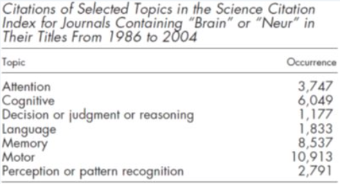  

上表中：总结 1986 年到 2004 年所有的有关「脑」和「神经」的 SCI  论文：如果按它们的关键词细分，你会发现「运动」（Motor）的文章数目最多，超过了「认知」、「语言」、「记忆」等文章。  

我自己在心理学系，我知道自己在认知圈子里的定位。

早期心理学或者认知科学一直低估了运动控制的复杂程度。一般人会以为，运动非常简单，其学习是程序性学习，是内隐的、不需要多少意识参与的。学习完成后，运动执行就像重新执行一段程序，不需要什么认知资源。其实这和我们自己的感觉是一致的。  

我们日常的行为表现中动作控制极其轻松。我们可以边走路边聊天。绊了一跤以后，只需要踉跄两步就可以马上恢复稳定行走。朋友抛过来的易拉罐装可乐，我们可以毫不费力地伸出上肢轻松抓握。看别人打个两三招拳法，我们就能模仿得像模像样。  

**何吉波：**  像 EEG, fMRI 都主要研究 perception 和决策，对输出和执行介绍的比较少。  

**魏坤琳：**  对，因为以前研究手段有限，接下来我就会提到。

那么，是不是运动控制真的非常简单？  

如果我们换个视角：假设我是工程师，需要设计一个类人型的机器人，我希望赋予它像人一样的运动能力。 这时候你就发现，刚才所有看似简单的运动任务，其实都难以实现。  

**何吉波：**  其实走路和刹车都不是自动化执行的。  

**魏坤琳：**  自动化永远都是相对的，我们从工程师视角来看看。  

a）机器人行走、上下楼梯、适应不规则的地表条件，甚至简单地保持动态平衡，都非常复杂。你会发现，至今人们还为机器人能开出一脚球、能上下楼梯而兴奋不已。

**何吉波：**  边玩手机边走路，或边开车都会影响我们执行过无数次的走路和刹车表现。  

**魏坤琳：**  计算机下国际象棋可以把人类秒成渣，但最先进的机器人的运动连 3 岁小孩水平都不够。

b）让机器人和人握手也是非常困难的事情，因为握手需要恰当的摆动力和握力，预先编程好的力或者摆动轨迹就过于生硬（设想和一个机器人握手吧）。其实，直接和人体进行物理交互的机器人的控制非常困难，需要用到复杂的阻尼控制和运动轨迹控制。  

c）让机器人直接用模仿的方式学习人的动作也很困难。当然，后来我们知道人脑中的镜像神经系统在模仿中间起到了至关重要的作用。  
 
最麻烦的事情到了：

d）更麻烦的是，工程师不知道人是如何同时控制多个关节，并协调它们完成流畅的运动的？这个看似根本就不是问题的问题，可以用一个简单的例子来说明。

假设我要把手从 A 点运动到 B 点。通常情况下，手的运动轨迹是一条直线，它的速度是一条倒钟形的曲线（先加速，再减速）。但是，人脑为什么要控制完成这样一个运动轨迹？要知道，这个简单的动作需要肩关节和肘关节的同时参与，但这两个关节其实都是转动，那为什么不直接让手划出一条「曲线」从 A 到 B 点，而是费力的协调两个关节以保证手走的是一条直线呢？很显然，人脑控制运动有它自己的逻辑。  

这个例子要过过脑……  

**何吉波：**  这个例子非常精彩！这个有点像对物体的跟踪和对接物体。需要处理 Tau 来修正运动。并不是知道一个开点和结束点，然后自动完成。  

**魏坤琳：**  总结：

> 我们不知道人脑是如何控制运动的，要不我们就能造出牛逼的机器人，像真正的人一样运动。

像下面这位：  
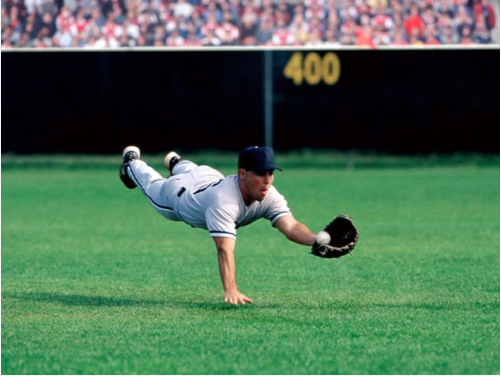   

控制复杂运动的运算量非常大，人工智能还早着呢。下面会有例子。  
「定义」运动控制就是研究：

> How the brain controls movements； how the brain learns to control movements；why it behaves in the existing ways.

重点是「How」和「Why」。  
可以看出，这个「运动」的问题不可避免地与其他认知领域的研究有交集，包括大家所熟悉的感知、决策、记忆、学习等领域。  

小结一下： 

* 运动控制在脑科学、认知科学的范畴内；
* 虽然带「运动」两个字，它和运动心理学关系不大。后者主要包括竞技心理学和健康心理学。它们的关键词是在竞技体育、大众健康上面；
* 运动控制是交叉学科，和心理学、神经科学、工程学、力学、医学相交叉；
* 和人工智能有交集：什么时候机器人能像人一样流畅、协调的运动？  

### 运动控制为何为心理学所忽视？

**何吉波：**  包括运动康复和特殊人群不？比如中风后的运动控制。我觉得除了做机器人外，还有是人员训练，以及 concussion, stroke 病人的康复。其实研究少，更有可能是技术手段不够。EEG 和 Fmri 都带来了心理学的变革。  

**魏坤琳：** 会有，后面有好多应用问题，接地气的。 但是，一定要先讲一些理论的，为什么这个烧脑的问题：

**为什么心理学或者认知科学过去一直忽视了「运动」？**

我有两个假说：  

1. 太难：人体运动很复杂，需要太多变量描述。早期研究一般只用反应时和准确率来描述运动，直接忽略运动的细节（比如运动轨迹）。现在研究运动控制稍微容易些了，我们有了更多的实验手段，比如三维动作捕捉、数学模型、脑成像等技术。  

2. 以往研究中，运动仅仅作为其他认知活动的表达，眼动用来研究阅读，眨眼用来研究记忆，脸部动作用来研究情绪，手势用来研究。大脑是如何对运动进行控制的却被完全忽略了。这个研究的盲点存在情有可原，但如果采取工程师的视角（Pinker 应该微笑了），或者上帝造物的视角，这些前人对运动的忽视，早就应该被认识到：如果我们发现赋予机器以类人的运动能力是非常困难的，我们就会意识到，其实人类自己对人脑怎么控制运动也知之甚少。  

直接切入运动控制的核心问题：「自由度问题」。
>在结构力学上的自由度（Degrees of freedom），或称动不定度（Degrees of kinematic indeterminacy），意指分析结构系统时，有效的结构节点上的未知节点变位数。-维基百科

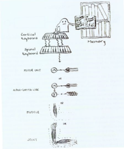  
请看看这个图。

**魏坤琳：**  传统心理学对运动控制的看法： 

> 运动控制是通过存储好的运动程序完成的。 

当人要完成某一个运动任务时，控制器（Executive，Homunculus，认知小人）选取储存的某一个运动程序。执行该程序：运动程序就像琴谱一样，告诉皮层和脊髓的运动区应该如何激活。皮层和脊髓再控制肌肉的激活，完成任务。  

就是上面那个图里面描写的、心理学家的看法。  

这样一个看似简单的模型，实则全是大坑： 

a）同一个运动有无数种执行方式（每次执行都不同，见下），大脑需要储存「无数」种运动程序？  

比如，手指尖的位移的控制由肩、肘、腕 3 个关节决定。肩有 3 个自由度（3 个方向的转动），肘有 1 个自由度，腕是 3 个自由度。  
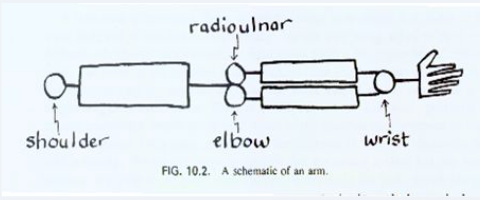  
这是个粗糙的人的胳膊啊，可以看见 3 个关节的自由度。  

在关节层面上，如果大脑要控制手指尖的位置，它需要同时调节 7 个自由度。在肌肉层面上，手臂上有 26 条肌肉，它需要控制这些肌肉的激活或者不激活（激活时间、强度另算！）26 个自由度。  

更糟糕的是，肌肉不是独立的控制单元，运动单元（Motor Unit）是一条运动神经和它连接的肌纤维组成；平均一条肌肉有 100 个运动单元。所以在运动单元的层面上，我们有 2600 个自由度。  

所以，光控制一条胳膊，只控制这 2600 个运动单元的开启/关闭，就有2^2600 种可能，应该是超过了宇宙中原子的数目。  

这个就是自由度（Degree of Freedom）的问题。运动系统的冗余度过大，无法直接「控制」每一个自由度。  

**何吉波：**
是不是需要个超级计算机来处理和执行这 2600 个自由度呀？我们大脑应该也不会这样去执行每种可能性吧？会不会只有肌肉的分组。

**魏坤琳：**
不是，计算机不能这样 Brutal Force 的去算。 

上面那个传统看法还有其他大坑：

b）所谓的运动程序是什么语法写的？  
c）运动程序是怎么写的？

**何吉波：**
肌肉群内的工作自己协调。  

**魏坤琳：**
肌肉群分组是一种方案，叫协同（Synergy），但还是不够。所以，坑太多，现在，领域内完全放弃了有关运动程序的观点，因为自由度的问题绕不过去。而且，闭环控制没有体现出来。  

### 内模型理论与最优反馈控制
**魏坤琳：**  我给大家看另一个模型：  
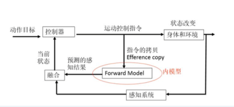   
目前的主流认识：「内模型理论」  

1. 控制器负责产生运动控制指令；
2. 运动控制指令发出给运动系统（肌肉等）之前，它同时将一份拷贝送给所谓「内模型」。内模型可以预测运动的结果；
3. 这个预测和感知系统发回来的反馈（有延时，有噪音）相结合，帮助大脑估计当前状态；
4. 如果预测和反馈不一致，就需要改变内模型及控制器。

我们经常体验到内模型预测。你有没有在下楼梯时被惊吓过：踩上原本以为有但实际上没有的最后一个阶梯。
 
**何吉波：**
感同身受啊。  

**魏坤琳：**
又比如，双手前平举拿着重物，松手。在你松手之前，你的躯干肌肉已经激活，因为人脑知道重物落下的物理后果：躯干平衡要受到扰动。躯干肌肉提前激活防止你被扰动。但以上模型有欺骗性：还是没有解决「控制指令是如何产生的问题」，「控制器」是怎么控制的？即，传统看法中的「控制小人」只是被「控制器」取代了而已。  

下面，是过去10年最重要的突破：

> 最优反馈控制（Optimal Feedback Control Theory）

试图解决人脑是如何实时「算」出来运动指令的。    

数学家 Emanuel Todorov，Michael I. Jordon 的学生，在2002年提出，并在 *Nature*，*Nature Neuroscience* 上发表了一系列文章。  

这里的 Michael Jordan 应该很多人知道，不是打篮球那位，哈哈。

理论的基本思想： 

1. 人的运动控制是大脑求一个最优解的问题, 同时人脑借助了前面图表中的反馈信息。  
2. 最优是针对某些和运动相关的指标：比如最大化运动精度，最小化能量损耗, 最小化控制努力程度（Control Effort, 就是说运动系统想偷懒的意思）。  
3. 反馈信息是不确定的，有延时的。  

**何吉波：**
有技术/办法干扰指令区和反馈区吗？要干扰大脑的运动处理，才好做因果推断，比如类似穿颅磁刺激（TMS）的方法？

**魏坤琳：**
通过建模（基于微分方程），Todorov 的理论可以解释运动控制几十年来积攒的 N 多争论。更牛的是，他的理论是数学上可行的，可以被拓展开来解释各种各样的运动。  

**Zoom.Quiet：**
目测, 现在最新的实现方案是从复杂系统理论入手? 将一个神奇的系统，分解为一群简单到极致的小单元，组合起来就能完成非常自然的行为……  

**魏坤琳：**
复杂系统理论在我的领域已经过时了。我博士导师就是那个流派的。  

Todorov 甚至只要提供一些物理的限制条件（比如 8 条腿的某生物，在某个低重力的环境下），同样的模型可以预测这样的生物运动模式是什么样子。  

**Zoom.Quiet：**
数学上可行……哈，这是学术界的免死金牌，和工程界相反，可用在先，再研究为什么……  

**魏坤琳：**
我个人觉得，他的模型应该马上被用于好莱坞的电影制作：每一个电脑模拟的人，只需要用这样的模型来驱动，就可以「自主」产生像人一样的流畅动作。他的个人主页可以看到模型、代码和很多有意思的录像。 [Movement Control Laboratory](http://homes.cs.washington.edu/~todorov/)  

Todorov 的东西不光是数学上可行，关键是解决了 N 多悬案。包括我前面讲的自由度问题等等。  

**何吉波：**
把他的代码和 Python panda 结合，做虚拟人物控制，可行不？  

**魏坤琳：**
可以，非常轻松。我再讲讲现在运动控制运算模块的**神经基础**。  

1. 运动皮层是控制器； 
2. 小脑是完美的内模型，在运动指令还没有达到肌肉之前，它可以预测动作的结果； 
3. 基底核是运动决策、强化学习的核心区域；
4. 很多皮层区域都可以做感知运动融合：比如 Posterior Parietal Cortex 是视觉输入和运动区交互的地方。

**何吉波：**
我们做运行控制，做机器人，还需要生物学家和工程师。用控制理论来做虚拟人物，只需要 Python 大妈和魏老师.  

## 运动控制的应用

### 脑机接口
**魏坤琳：**
好，下面可以讲应用问题了，前面给大家讲了一个理论问题，即**内模型理论**和**最优反馈控制理论**。  

**何吉波：**
如果代码可以完美控制，我们就不用花那么大的努力来训练人们做一个 Vigilance Test 来执行了。代码的 reliability 应该比人更可靠。  

**魏坤琳：**
手动对接的目的是计算机完蛋后，人顶上。  
  
 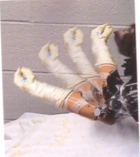  
「脑机接口」的经典图片，猴子用机器手给自己喂花生。  

**阳志平：**
*[MONKEYS USE MINDS TO MOVE TWO VIRTUAL ARMS](http://www.nicolelislab.net/?p=492)*
猴子实验非常经典，这个研究者拿诺贝尔奖的呼声很高。

**魏坤琳：**
Nicolelis（2003）：在猴子的运动皮层植入电极。 
 
* 第一步，先让猴子自己喂自己花生吃，然后反推出动作对应的神经活动；
* 第二步，这样的神经活动可以驱动机器臂做同样的动作；
* 第三步，猴子会突然认识到，不需要动自己胳膊，光靠想就能驱动机器臂喂自己吃花生。

几乎所有的 BMI（Brain Machine Interface）都是这样的套路：

> 需要训练程序识别什么神经信号对应什么运动，然后用这样的信号去控制机器外设。

我们做的机器假肢，和北大工学院合作。  
[Robotic Leg](http://v.youku.com/v_show/id_XODc4NzUyMDg4.html)  

我刚上传的视频，是下肢截肢患者在北大走动，使用的是我们做的智能动力假肢。  

**何吉波：**
嗯，他有 Phamton Limb 的感觉不？  

**魏坤琳：**
一般人都有，多年以后都有。没有使用肌肉电信号，而是使用了电容组。可以不和皮肤接触，不怕汗液，不怕肌肉疲劳。还有其他传感器：压力传感器、陀螺仪等。我们的创新点是用了电容组，而不是神经信号。电容测量的是人的肌肉的形变。这是我的主意，是超越国外竞争单位的歪招。因为肌肉电信号（他们用的）不可靠，脑电也无法控制这样的复杂外设。  

**何吉波：**
这个电容组更好一些。  

**阳志平：** 
精彩。BCI 传输速率有限，稳定性不好，还需事先训练，但肌肉电信号没这些弊端。

**何吉波：**
通过肌肉形变可以做到的话，就可以把心理学和工程学模块化了。   

**魏坤琳：**
机器假肢做出来了，意味着下面的外骨骼也没问题了。我们在做帮助中风病人站立行走的外骨骼。  

**何吉波：**
只是肌肉形变的信号效果会比肌电信号做得更好吗？  

**魏坤琳：**
好一些。  

**何吉波：**
如果肌肉无控制地抽搐怎么办呢？  

**魏坤琳：**
不怕出汗，不怕肌肉疲劳。那也是肌肉电信号的弊端。下面请大家开脑洞一下：

>既然可以人造出人脑的运动控制信号，那么下一步就应该是人造的感知信号。如果两个都可以人造，《黑客帝国》里面不用动弹的人的未来就来了。

这恰恰是一帮人在做的：  
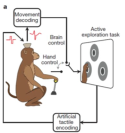  
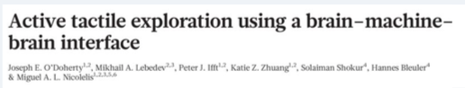  

还是 Nicholelis 实验室，2011年的 *Nature* 文章。

**阳志平：**
Nicolelis 的 TED 演讲：
[A Monkey that controls a robot with its thoughts. No, really.](http://www.ted.com/talks/miguel_nicolelis_a_monkey_that_controls_a_robot_with_its_thoughts_no_really) 
 
**何吉波：**
可以这样呀。再做一个感受器，感受我的肌肉形变，然后去控制另一个机器人，远程控制的。  

**魏坤琳：**
对，他们更绝，刺激猴子的感知皮层，让其产生虚拟的触觉。这个触觉是与它的运动控制同步的，这令猴子产生了误以为是自己的动作造成的触觉。别忘了，Nicholelis 的猴子动作都是 BMI 的，也就是说，运动控制是假的，感知也是假的。  

**Zoom.Quiet：**
BMI...原来是这个意思。脑电接口...不过一定可以非接触式! Matrix 中插入式的，太...  

**何吉波：**
他们用的 EEG 做的 BCI？欺负猴子呀，一切都是幻觉...  

**魏坤琳：**
不是，是直接将电极连接在皮层上。  

**张警吁：**
如果是不同步的话呢？  

**魏坤琳：**
不同步暂时不行。长时间效果不知道，还要考虑可塑性。  

**何吉波：**
同步是一个大问题，毕竟在飞船控制、军事中，远距离信号传输是会有延迟的。  

**胡悦：**
应该是 ECoG（皮层脑电图）。  

**陈恒达：**
有时候真会瞎想，我们的生命是不是一种远程控制。  

### 虚拟现实
**魏坤琳：**
还有时间讲运动员大脑不？还是讲虚拟现实？  

**何吉波：**
两个都想听。只要你讲，主持人一定在。那就虚拟现实吧，被 Hololens 吸引了。   

**魏坤琳：**
好，虚拟现实。先上图片。

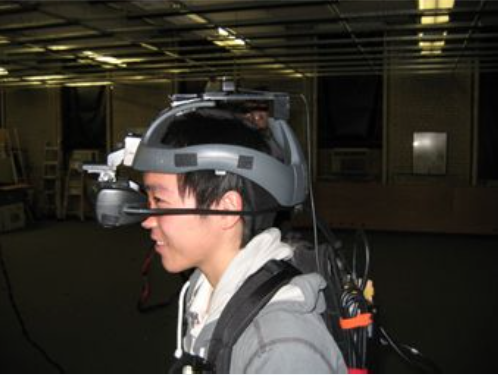  

这是我们早期用的虚拟头盔。  

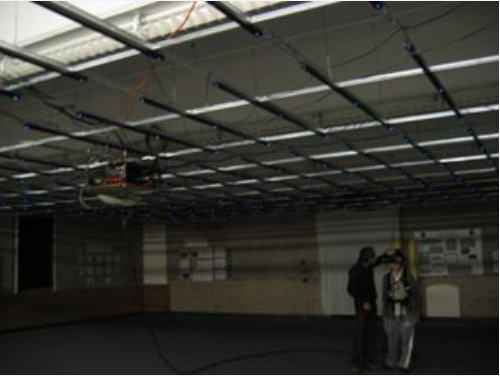  

戴头盔在大的空间里面走。  

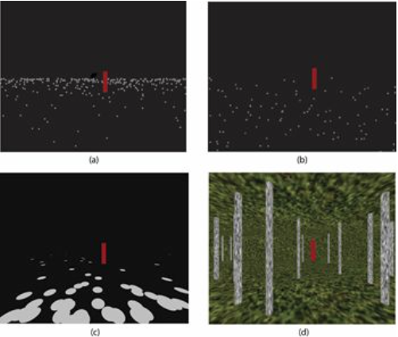  

你看见的世界可能是这样的 4 种。明显是心理物理学实验，想研究哪些视觉信息决定人的运动行为，所以很多视觉信息被 taken out 了。
  
**何吉波：**
Optical Flow。  

**魏坤琳：**
现在用 Oculus Rift Dev2。  
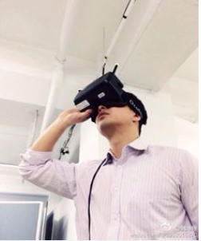  

无耻地用了自己的照片。  

**何吉波：**
UICU 的 CAVE 就是这样的效果。  

**魏坤琳：**
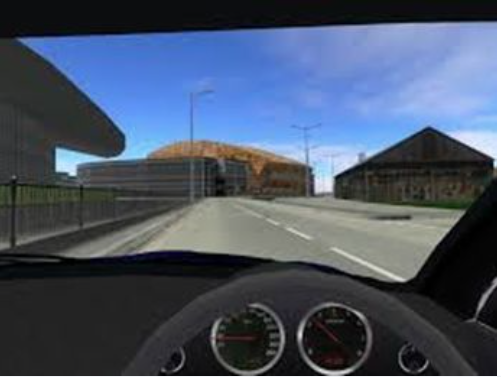  
当然，你可以用这个来做虚拟驾驶。 
 
**何吉波：**
高瞻远瞩呀。我发文章是用我系主任做模特。正在考虑此事，用它来做飞行和驾驶。或者来控制飞机。我系主任做无人机的。    

**魏坤琳：**
牛！的确可以。 
 
>为什么沉浸式的虚拟现实会如此不同，会如此逼真？

我说两个理由，第一个：    

* 多通道感知信息整合的威力；  
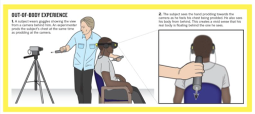  

上图是灵魂出窍的小实验：被试眼镜内播放的是实时的、身后的摄像机的视角图像，主试用两根木棍做同样的戳的动作。一个棍子戳被试的胸口，一个棍子假装在摄像机镜头前戳。只需要1分钟，被试就会有错觉，以为自己的灵魂出窍，在自己身后（即摄像机的位置）注视着自己。

原因很简单：视觉输入和触觉输入是同步的、一致的。大脑会非常相信这种多通道感知信息一致的刺激。该刺激的唯一解释是：我坐在这个人的身后注视着他。 

第二个虚拟现实可以很牛逼的理由：  

* 人的主动运动控制和感知反馈的一致性。
 
所谓 consciousness 有很大一部分是自我的概念，自我的一个重要部分是 Sense of Agency，agent 就是主动施动者，即主动产生运动的人。 如果在虚拟现实中，你主动产生动作，动作的结果能和你得到的反馈一致，你就会有极强的真实感。这样的控制和反馈一致性很容易实现：动作捕捉系统实时测量你的运动，让该运动改变虚拟环境中的物体。

**何吉波：**
调节这两个行为的时间间隔!  

**魏坤琳：**
这个实验被人做过了，时间和空间的差异可以改变人的因果推理，我有一篇文章专门做这个。

*[Relevance of Error: What Drives Motor Adaptation?](http://jn.physiology.org/content/101/2/655.short)*

这个是讲运动控制中的因果推理，应该是我引用最高的文章，140+。  
虚拟现实的帷幕刚打开，我们在等它的 killer app。可以预测到的是，它会深远改变人的认知。  

**Zoom.Quiet：** 
目测, 第一个 killer app 不应该在民用领域, 星际/深海/高空……有大把刚需……  

我的主要感触是: 这一最前沿的领域, 中国人也在折腾, 好赞!  

### 长期运动经验的影响

**何吉波：**
还有20分钟。我们请魏老师讲一讲运动员的大脑吧。  

**魏坤琳：**
长期运动经验的影响（专家大脑），最神奇的变化当然是：

 1、相关的运动和感知区域的结构性变化；
   
比如初级运动皮层的突触数目增加，效应器（比如打球的胳膊）的表征区变大，灰质变厚。初级感知皮层(S1)的表征区变大；比如各个区域之间的连接性增强（白质），比如对体操运动员的研究。  

这个白质研究应该是北师大脑所做的，突触数目是用老鼠做的。一个要注意的地方是：结构性变化有时候可逆，比如训练结束几周后灰质厚度又减小了。  

**何吉波：**
我导师就是在研究运动员是不是更 fit，认知和决策能力是否更好，玩游戏的人开飞机或者开车是否更好。  

**魏坤琳：**
的确，这些也是做得比较多的研究。  

**何吉波：**
研究训练多久才有效的研究很多，不过似乎关注多久失效的研究就少一些了。  

**魏坤琳：**
很明显，测大脑的变化，对运动类的来说，是很困难的。一般我们扫脑的时候不让人做大的动作。  

**何吉波：**
Fitness Training 和 Neuro Plasticity，相信老阳也很感兴趣。  

**魏坤琳：**  2、激活方式的变化。
  
例如：精英运动员更擅长过滤掉无关信息，表现在选择性注意力好。当然不是说他们的一般注意力比较好，而是特定的、和运动相关的注意力。 无关的脑区激活少，比如杏仁核等与情绪和 awareness 有关的脑区。即他们运动时比较冷静。  

这个选择性注意能力的提高很重要，运动情景可以很复杂，好的运动员只会注意最重要的环节。 
 
**张警吁：**
fNIRS 在做运动员时会有优势吗？  

**阳志平：**
其实，我也有个感觉……精英更擅长于过滤掉无关信息，表现在选择性注意力好。不仅是精英运动员。  

**魏坤琳：**
fNIRS 有优势，当然精度有限。对，这个过滤和选择性注意，带给那些精英运动员极大的优势。Again，他们不是光靠肌肉的，靠的还是大脑。  

3、运动员的运动控制自动化。
  
不再需要太多的认知资源，可以多任务同时进行。在运动技能提高的同时，相关脑区的激活降低，比如前额叶和后顶叶。  

这个大家都有直观认识：某个运动自动化以后，注意力和认知资源就可以看别的地方了，比如注意某些运动的对手的一些细节。  

**何吉波：**
运动员的选择性注意能力强，过滤无关信息更强，那他们是更好的还是更差的 multitasker?  

**魏坤琳：**
有意思的是那些 monitor 自己运动的脑区激活下降，是更好的 multitasker。  

一般运动学习的3个阶段： 

 1. Cogntive / Explicti 阶段，需要很多注意力，需要很多外部指导；   
 2. Associative 阶段，主要把各种运动技能的细节联系在一起；  
 3. Automatical 阶段，自动化了，专家化了。  

**侯悠扬：**
有研究 Choking 的神经机制吗？所谓的掉链子。  

**魏坤琳：**
有。关于 Chocking 我还发过一篇文章，做着好玩的。我做得极杂。  

**何吉波：**
更好地 Selective Attention，Attention Division 可能会更差……不知道有人研究 Multitasking Performance of Athletics。  

**魏坤琳：**
Choking 还是高级认知的抑制，但是还是有不少竞争的理论。  

4、精英运动员的运动决策能力的提高
  
复杂运动环境下，需要快速而准确的决策。想象你是一个控球后卫，跑动同时需要一直观察场上的瞬息万变的形势，做出传球或攻击的最佳决策。  

精英运动员快速提取信息，并做出决策的能力很突出。一般情况下，越复杂的运动项目（篮球、足球等），越需要这种决策能力。  

心理学研究最喜欢做运动的决策，因为比较好操控，一般是提高不同量和质的信息，看看运动员决策的好坏和速度。  
